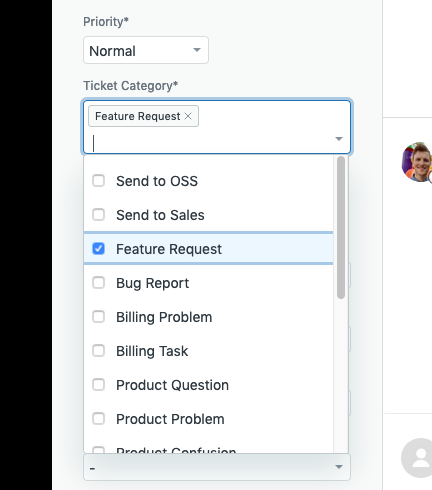
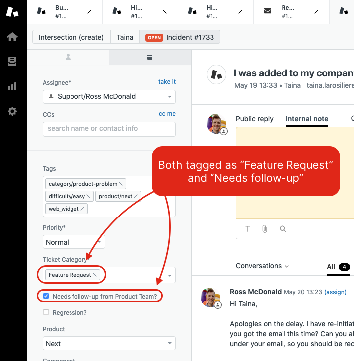

# Handling Feature Requests

## Marking Tickets as Feature Requests

If a user has requested a feature or enhancement, select **Feature Request** from the "Ticket Category" selection.

This can be selected in combination with other categories, so be sure to click other categories that apply.

## Flagging Tickets as Needing Feedback from Product

From the Zendesk Agent interface, a ticket needs to be tagged as **both**:

* Feature Request
* Needs follow-up from Product Team

Once done, any update on the ticket will be pushed to [ProductBoard as an insight](https://stoplightio.productboard.com/insights). These tickets are then reviewed by the Product team and can be reviewed in collaboration with Customer Success on the bi-weekly product syncs.

## Effectively Using ProductBoard

ProductBoard is a tool used by the Product team to plan and catalog upcoming product changes, and is the main integration point between CS and Product. ProductBoard can be accessed [here](https://stoplightio.productboard.com).

> If you do not have access to ProductBoard, please ask for access in the \#dept-product Slack channel.

### Commenting on Insights

Insights can be commented and user's can be notified by using the text-box at the bottom:

### Finding a Previous Insight

It's hard. We need a better solution.

